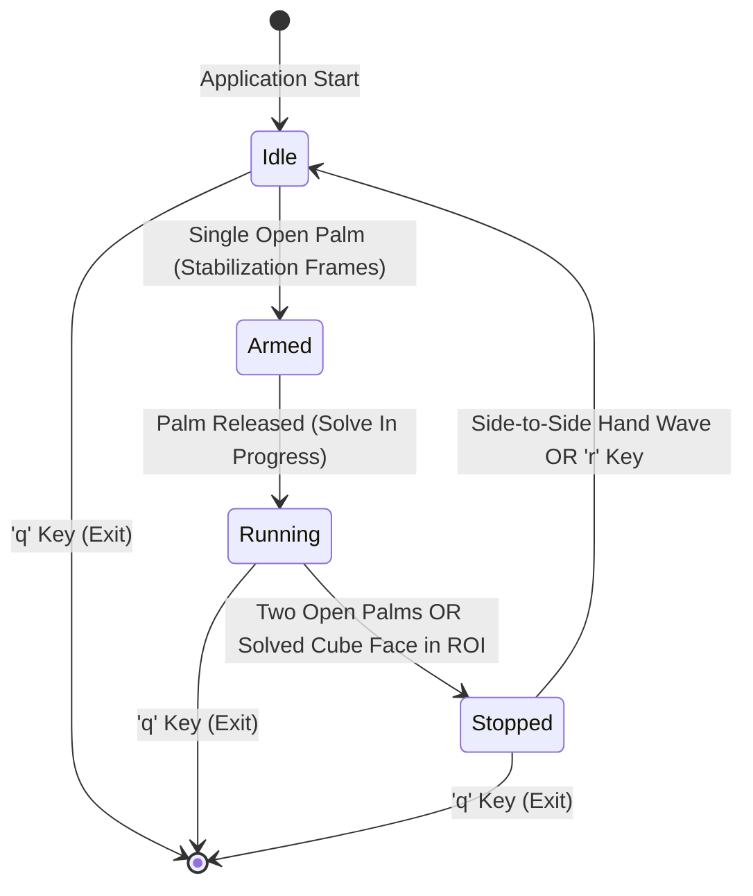

# CB-watch

[](https://github.com/ItzSaurav/CB-watch/actions/workflows/ci.yml)

A touchless, gesture-controlled Rubik's Cube timer utility built in Python using OpenCV and Google MediaPipe to track hand gestures and cube faces directly through your webcam.

---

## State Machine Flow



---

## Why I Built This

Speedcubers usually rely on physical stackmat timers or smash their spacebars repeatedly to start and stop solves. Repeatedly slamming a laptop keyboard causes physical wear, and regular mobile timer apps require touching the screen with sweaty or lubricated hands. I built CB-watch to experiment with computer vision and create a hands-free timer that responds naturally to open hands, waves, and solved cube faces.

---

## How It Works

1. **Start the Timer**: Show one open hand to the webcam. Once detected for a few stabilization frames, the timer transitions from `WAITING` to `RUNNING`.
2. **Stop the Timer**: Show two open hands to the camera upon finishing the solve, or place a solid solved face of the Rubik's cube inside the center detection box on the screen.
3. **Reset the Timer**: Wave your hand from side to side in front of the camera, or press the `r` key on your keyboard.
4. **Exit**: Press `q` to close the webcam window.

---

## Computer Vision Details

- **Hand Landmark Tracking**: Google MediaPipe's `HandLandmarker` model extracts 21 3D coordinates per hand. We calculate the Euclidean distance between fingertips and MCP (metacarpophalangeal) joints relative to the wrist to determine whether fingers are extended or curled.
- **Wave Gesture Detection**: Tracks the horizontal (x-coordinate) trajectory of the hand across recent frames. If the motion vector reverses direction four or more times with sufficient amplitude, a wave gesture is registered to reset the timer.
- **Solid Cube Face Detection**: Extracts the region of interest (ROI) from the center bounding box, converts pixels from BGR to HSV color space, and calculates the standard deviation of the hue channel alongside the mean saturation. A low standard deviation combined with high saturation confirms a uniform solid color face.

---

## Requirements

- Python 3.8+
- OpenCV (`opencv-python`)
- Google MediaPipe (`mediapipe`)

---

## Installation and Setup

### 1. Clone the Repository
```bash
git clone https://github.com/ItzSaurav/CB-watch.git
cd CB-watch
```

### 2. Install Dependencies
```bash
pip install opencv-python mediapipe
```

### 3. Run the Script
```bash
python main.py
```

*Note: The script will automatically download the 8MB `hand_landmarker.task` model file from Google's model storage if it is not already present locally.*

---

## License

MIT License. Free for speedcubers, developers, and students.
